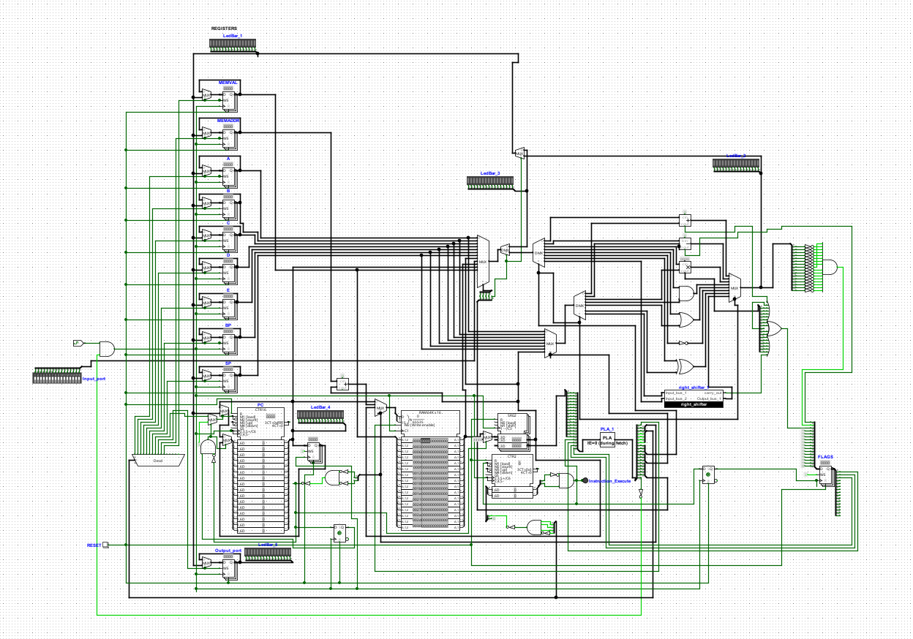
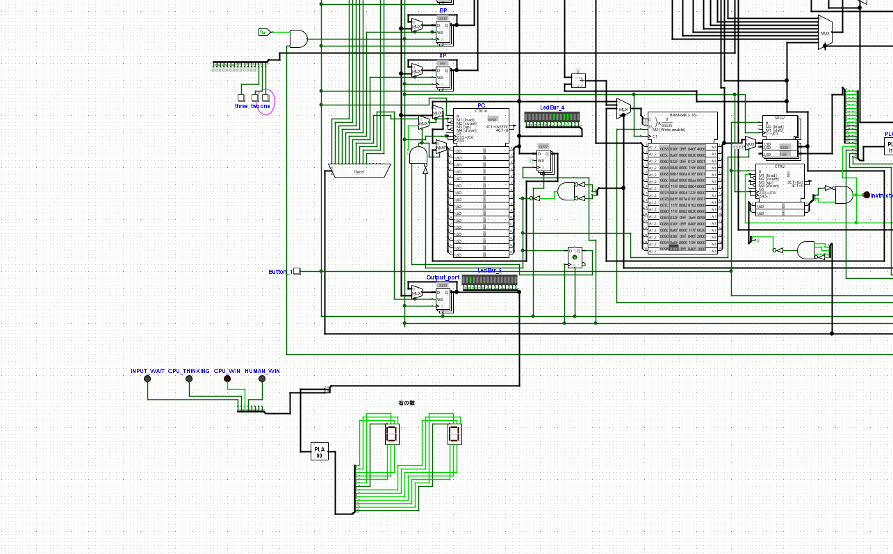

# Welcome to NC-16!

　NC-16のGitHubページにようこそ！　NC-16はLogisim-evolution（論理回路シミュレータ）上で動作する16bitCPUです！　回路自体はもちろん、各種ドキュメントも全て公開されており、やる気さえあればNC-16の全てを知ることが可能です！
　またNC-16はMITライセンスで公開されていますから、NC-16をベースにして別のCPUを作り公開することも可能です。
## NC-16の特徴
　NC-16は、以下の特徴を備えた16bitCPUです。
- シミュレータ（logisim-evolution）上で動作するCPUであるため、部品（例：FPGA）を追加購入する必要がない。logisim-evolutionが動作する環境さえあれば、いつでもどこでもNC-16を使用できる。
- CPUの内部回路、CPUの内部挙動を視覚的に把握可能。見たいところに好きなだけプローブを置くことができる。
- NC-16は、すべて現実で構成可能な部品を用いている（※1）。シミュレータでしか動作しない部品は使用していない。よって、各構成部品についても、トランジスタレベルまで回路を分解可能。
- 64KBのRAMを使用可能。メモリ読み込み、書き込みを要する複雑な処理が実行できる。例えば以下の処理が挙げられる。
  - push命令やpop命令を用いてスタックを実装可能。
  - call命令やメモリ操作命令を組み合わせて、関数やローカル変数を実装可能。
- もちろんあなたが作ったプログラムをNC-16で実行させることも可能！

※1：全部品がFPGAにエクスポートできることをもって。現時点（2026/06/21）でNC-16がFPGA上で動作することを保証する文言ではない。
## 導入方法
　Logisim-evolutionとアセンブラであるcustomasmを導入する必要があります。インストールの詳細については、以下ページをご覧ください。

https://github.com/logisim-evolution/logisim-evolution

https://github.com/hlorenzi/customasm

※customasmはRust上で動作するプログラムであるため、Rustを導入していない場合は、Rustを導入する必要があります。
## NC-16操作マニュアル
　NC-16の操作方法については、以下のリンクをご覧ください。
[マニュアル](./manual.md)

## ドキュメント
　NC-16のドキュメントは以下のリンクから飛べます。
[ドキュメント](./Document.md)