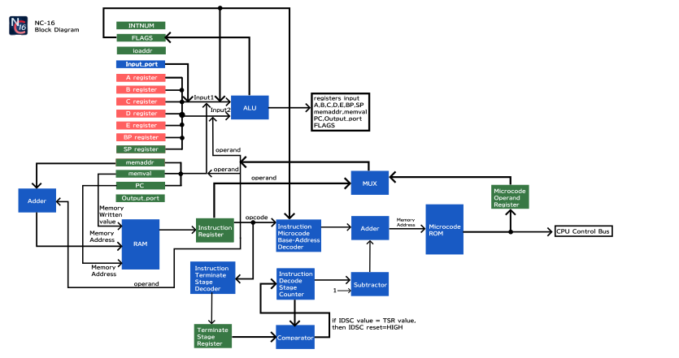

# NC-16　Architecture
## NC-16 ピンアサイン
　NC-16のピン配列は次の通りです。
- CLK：クロックを入力します。
- out_ext：CPUからの出力信号が流れます。データ幅は16bitです。
- out_st：出力ストローブ信号です。output_portレジスタに値が書き込まれたときだけ1を出力します。内部的にはoutput_portレジスタのWE（書き込み有効）信号に接続されています。
- in_ext：外部機器からCPUへのデータ入力を行うピンです。データ幅は16bitです。
- in_st：入力ストローブ信号です。外部機器からデータの書き込みがあったときだけ1を入力します。
- ioaddr：入力/出力アドレスを出力します。
- INT：割り込み通知用ピンです。INTに1を入力すると、NC-16に割り込みが通知されます。
- INT_NUM：割り込み番号通知用ピンです。
- RESET：リセット信号を入力します。リセット信号を1にすると、NC-16の初期化処理が実行されます。
- cpu_status：CPUの現在の状態を表示します。HLT命令実行中、通常実行中、アボートによるCPU強制停止等です。
- int_ret：割り込み処理からの復帰を伝えます。割り込み処理から復帰直後1クロックだけ1を出力します。それ以外は0を出力します。
## NC-16 Block diagram

## レジスタ・I/Oポート
6つの汎用レジスタ、スタックポインタ、プログラムカウンタ、MEMVALレジスタ、MEMADDRレジスタ、一つの入力ポート、一つの出力ポートを備えています。
### 汎用レジスタ
A,B,C,D,E,BPの六つのレジスタが存在します。各レジスタのビット幅は16bitです。各種計算やデータの保持にお使いいただけます。
BPレジスタは名前こそx86系のebpと同じですが、使用目的に特に制限はありません。x86系のebpと同じ目的での使用も出来ますし、a,b,c,d,eレジスタと同じく一般の計算用途としてもお使い頂けます。

私が制作したNC-16向けのプログラムにおいては、BPレジスタはa,b,c,d,eレジスタと同じく一般の計算に用いています。
### スタックポインタ(SP)
RAM上にあるスタック領域の開始アドレス番号を指し示します。x86系CPUにおけるESP等と同じ役割です。**SPレジスタは常にスタック領域の開始アドレス番号を指し示すため、一般の計算用途では使用できません。不用意な変更は重大なバグに繋がる恐れがあります**。
### プログラムカウンタ(PC)
CPUが現在実行中のアドレスを指し示します。x86系CPUにおけるRIP等と同じ役割です。
### MEMVALレジスタ
　RAM書き込みの際に使用されるレジスタです。MEMVALレジスタ経由でRAMへの書き込みを行います。
### MEMADDRレジスタ
　RAM読み込みの際に使用されるレジスタです。RAMから読みだすアドレス番地を指定する際に用いられます。
### ioaddrレジスタ
　input_port,output_portの入力先/出力先アドレスを指定します。あるアドレスへデータを出力する場合は、ioaddrレジスタに指定のアドレスを格納した後、output_portにデータを格納するという手順を取ることになります。
　入力先を指定する場合でも、出力先を指定する場合でも同じioaddrレジスタを使用します。
### INTNUMレジスタ
　割り込み種別を格納するレジスタです。NC-16に割り込み信号を入力する際、割り込み種別（どの外部機器から割り込み信号が発せられたか、どのような内部割込みが発生したのか）を指定する必要があります。割り込み信号を入力する前にINTNUMレジスタに割り込み種別を意味する値（割り込み番号）を格納しておくと、その割り込み種別に応じた処理が実行されます。
### フラグレジスタ(FLAGS)
キャリーフラグやゼロフラグ等、CPU実行の状態を表すフラグが格納されます。ビット幅は16ビットであり、各ビットの意味は次の通りです。
|bit|意味|
|:--:|:--:|
|0|符号フラグ。算術演算や論理演算において結果が負であった場合に1にセットされます。結果が正であった場合は0にセットされます。0は正の値と見なします。|
|1|ゼロフラグ。算術演算や論理演算において結果がゼロであった場合に1にセットされます。ゼロでなかった場合には0にセットされます。|
|2|キャリーフラグ。算術演算や論理演算において桁あふれを起こした場合に1にセットされます。起こしていなかった場合には0にセットされます。|
|3|割り込み通知フラグ。割り込み通知フラグが1になるとNC-16は割り込み処理を実行します。割り込み通知フラグが0のときは何もしません。処理の都合により割り込みハンドラが呼び出される時点で、割り込み通知フラグは0になります。
|4|割り込み禁止フラグ。割り込み禁止フラグが1のとき、割り込み通知フラグは1に出来ません。INTNUMレジスタへの書き込みも無効となります。割り込み処理中のとき割り込み禁止フラグは1になり、割り込み処理が終わると割り込み禁止フラグは0になります。割り込み禁止フラグが0のときは、割り込み通知フラグを自由に変化させることができます。
|[16:5]|未使用|

### 入力ポート(Input_port)
16bit幅の入力ポートを一つ備えています。
### 出力ポート(Output_port)
16bit幅の出力ポートを一つ備えています。
### RAM
NC-16はアドレス幅16bit、入出力幅16bitのRAMに対応しています。
## ALU
NC-16内部に存在するALU(Arithmetic Logic Unit)は二つの入力、Input1とInput2に対し算術演算を行います。対応している算術演算は次の通りです。
1. 加算
2. 減算
3. 乗算
4. 右シフト
5. AND
6. OR
7. XOR
8. NOT

Input1は下記から選択可能です。ALU Input1 Select and ALU bypassを用いて選択します。
1. Aレジスタ
2. Bレジスタ
3. Cレジスタ
4. Dレジスタ
5. Eレジスタ
6. BPレジスタ
7. SPレジスタ
8. MEMADDRレジスタ
9. MEMVALレジスタ
10. Input_data
11. オペランド

Input2は下記から選択可能です。ALU Input2 Selectを用いて選択します。
1. Aレジスタ
2. Bレジスタ
3. Cレジスタ
4. Dレジスタ
5. Eレジスタ
6. BPレジスタ
7. SPレジスタ
8. オペランド
