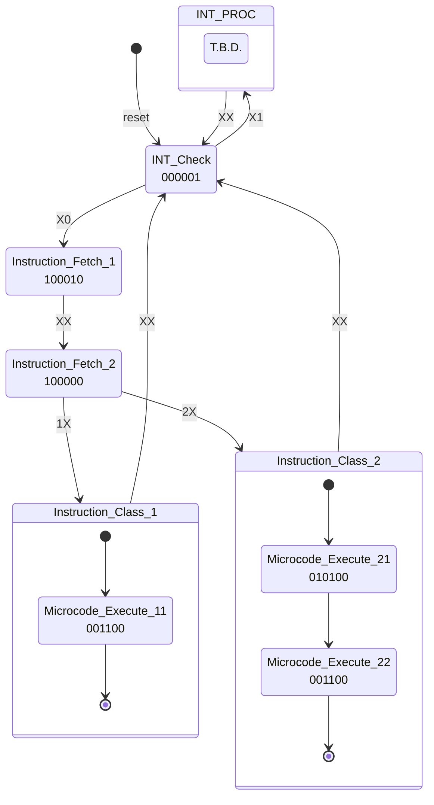

# Instruction_Decoder_Specification
## 命令実行までの過程
　本節ではRAMに格納された命令がCPUによって読みだされ実行されるまでの過程について解説します。

　現状のNC-16には、他市販CPUで見られるようなパイプライン実行、Out of Order実行、スーパースカラ等の高速化のための機構は搭載されていません。命令フェッチ、命令解釈、命令実行の各手順をメモリに記載されている順番通りに行うだけです。

　CPUの制御はCPU Control BUSを用いて行われます。CPU Control BUSに、CPUに行わせたい処理に応じた信号を出力した状態でクロックを立ち上げると所定の処理が行われます。命令デコーダはメモリから読み取った命令種別に応じて、適切なタイミングで適切な信号をCPU Control BUSに流す役割を負っています。

　一つの機械語に対し一つのCPU Control BUS信号が対応しているとは限りません。一つの機械語に対し複数のCPU Control BUS信号を対応させたい場合があります。例えばpush命令、pop命令等です。これを達成するため、NC-16では"マイクロコード"を用意しています。大雑把に言えば、マイクロコードとは複数のCPU Control BUS信号をまとめたものです。マイクロコードはMicrocode ROMに記録されています。
### Internal Decoder Control
　メモリから適切なタイミングで命令を読み込み、Microcode ROMから適切なタイミングでマイクロコードを読み込んで実行するには、Instruction RegisterやMicrocode Fetch Count Registerなど、命令デコードに使用する部品を適切に制御する必要があります。これらの部品を制御する信号群をDecoder Control BUSと呼びますが、このDecoder Control BUSへ信号出力を行っているのがInternal Decoder Controlです。

　Internal Decoder Controlは有限状態マシンとして実装されています。Internal Decoder Controlの状態遷移図は後述します。
### Instruction class
　命令にはクラスという数値が割り当てられています。ある命令では「Microcode ROMからの読み出し1回で終わる」、ある命令では「命令実行が完了するまでにMicrocode ROMから4回読み出しする必要がある」など、命令によってInstruction RegisterやMicrocode Fetch Count Registerなどの制御方法が異なる場合があります。IRやMFCRの制御方法が同じである命令をとりまとめたもののことを**クラス**と呼びます。

　命令の分類はInstruction classfierで行っています。与えられオペコードを元に、対応するクラスを出力します。

　現在次のクラス値が定義されています。
1. 1：マイクロコード長1の命令
2. 2：マイクロコード長2の命令
3. 4：マイクロコード長4の命令
4. 5：マイクロコード長5の命令
5. 6：マイクロコード長6の命令
6. 8：マイクロコード長8の命令

### Microcodeの読み出し
　Microcode ROMからマイクロコードを読み出すには、Microcode ROMに、命令に対応したマイクロコードが格納されているメモリアドレスを指定する必要があります。このメモリアドレスの算出を担っているのが、IBMDとMFCRです。IMBDはオペコードからマイクロコードの起点アドレス（命令に対応したマイクロコードのうち、一番最初に実行されるマイクロコード）を出力します。

　命令に対応したマイクロコードを全て読み出すには、起点アドレスから順番に一ワードずつ読み込んでいく必要があります。つまりMicrocode ROMに入力するアドレスを1つずつ変化させる必要があるということです。

　この動作を達成するために、Microcode ROMに入力するアドレスはIMBDから出力された起点アドレスに、MFCRを足したものになっています。MFCRの値をカウントアップすれば、無事マイクロコードを一つずつ出力させることができます。

　当然命令によって何回MFCRをカウントアップさせれば良いかは異なります。その制御はIDCが行います。IDCの制御によって命令に対応したMicrocodeが適切に読みだされ実行されるようにします。

### 命令の大まかな実行手順
　命令は大まかなには次の手順で実行されます。詳細な実行手順については状態遷移図やMicrocode仕様をご覧ください。

1. メモリから読みだした命令をIRに転送する。
2. IRからオペコードを取り出し、IMBDとInstruction Classifierに入力する。
3. IMBDが出力したマイクロコードの起点アドレスにMFCRの値を足したものを、Microcode ROMに入力するメモリアドレスとする。
4. Instruction Classifierが出力したクラス値を元に、IDCがMFCRを制御して命令に対応するマイクロコードがすべて実行されるようにする。
5. 手順1へ戻る。

## 各部解説
　命令デコードに関わる部品を解説します。
### Instruction Register(IR)
　メモリから読みだした命令を格納するレジスタです。実体は16bit X 2のシフトレジスタです。
### Instruction Microcode Base-address Decoder(IMBD)
　オペコードに対応するマイクロコードが格納されているアドレスを、IRから与えられたオペコードを元に算出します。
### Microcode Fetch Count Register(MFCR)
　IMBDで算出した値から、どれくらい先のアドレスのデータを読み出すかを指定するレジスタです。Microcode ROMに入力されるメモリアドレスは、IMBD + MFCRになります。
### Microcode ROM
　マイクロコードが格納されているROMです。
### Microcode Operand Register(MOR)
　マイクロコード実行時にオペランドとして使用するレジスタです。マイクロコード実行時、機械語で与えられたオペランド（IRに格納されたオペランド）以外に、別の値を命令のオペランドとして指定したいときがあります。例えば機械語で与えられたオペランドに3を加算する場合、3という値をどこかで抱え持っておく必要があります。レジスタ、ALU側に与えるオペランドとしてIRに格納されたオペランドを指定するか、MORのオペランドを指定するかは、マイクロコードで選択できるようになっています。
### Internal Decoder Control(IDC)
　命令デコーダの各部品を制御する信号（Decoder Control BUS）を出力する部品です。

　IDCに入力される信号（IDC Input）一覧です。
- Instruction Class Value：Instruction Classifierから出力された命令のクラス値です。
- INT：INTがHのとき、割り込みが起きたことを意味します。Lのとき割り込みは起きていないことを意味します。

|bit|意味|
|:--:|:--:|
[2]|Instruction Class Value
[1]|INT

　IDCから出力される信号（Decoder Control BUS）一覧です。

- IR Fetch Enable：IR Fetch EnableがHのとき、クロックが立ち上がったときの、メモリからIRへのデータ読み込みを有効にします。Lのときデータ読み込みを無効にします。
- MFCR Count Enable：MFCR Count EnableがHのとき、クロックが立ち上がったときの、MFCRのカウントアップを有効にします。Lのときカウントアップを無効にします。
- MFCR Zero Load：MFCR Zero LoadがHのとき、次のクロックが立ち上がったときにMFCRの値を0にセットします。Lのときは何もしません。
- CCB Gate Switch：Microcode ROMからの出力をCPU Control BUS(CCB)に出力するかしないかを選択します。0b1のときMicrocode ROMからの出力をCCBに出力し、0b0のときNOP相当の信号をCCBに出力します。
- PC Count Enable：PC Count EnableがHのとき、クロックが立ち上がったときの、PCのカウントアップを有効にします。Lのときカウントアップを無効にします。
- INT Gate Switch：0b1のときInstruction ClassifierへのINT信号の入力を有効にします。0b0のときINT信号の値が何であれ、Instruction Classifierには0b0のINT信号が入力されます。

|bit|意味|
|:--:|:--:|
[5]|IR Fetch Enable
[4]|MFCR Count Enable
[3]|MFCR Zero Load
[2]|CCB Gate Switch
[1]|PC Count Enable
[0]|INT Gate Switch

　IDCの状態遷移図は次の通りです。状態に書かれた2進数はDecoder Control BUSを表します。

　各状態は8ビットの値で表されます。各状態に対応した値は次の通りです。
|状態名|値(10進数)
|:--:|:--:|
|INT_Check|0|
|Instruction_Fetch_1|1
|Instruction_Fetch_2|2
|Microcode_Execute_11|3
|Microcode_Execute_12|4
|Microcode_Execute_21|5
|Microcode_Execute_22|6

## Microcode仕様
|bit|意味|
|:--:|:--:|
[23]|未使用
[22]|未使用
[21]|MOR write enable
[20]|IR operand or MOR operand select
[19:0]|CPU Control BUS

> Microcodeのビット数を変更する場合は、ROMデータジェネレータの都合上、8の倍数ビットにしなければなりません。ファイルの読み書きがバイト単位でしか行えないためです。

### MOR write enable
　MOR write enableが0b1のとき、該当のワードの下位16ビットをMORに書き込みます。このときCPU Control BUSにはnop相当の信号が出力されます。0b0のとき該当ワードの下位20ビットをCPU Control BUSに出力します。
### IR operand or MOR operand select
　Instruction Decoderから出力するオペランドを、IRに格納されているオペランドとするか、MORに格納されているオペランドとするか選択できます。0b0のときIRに格納されているオペランドを、0b1のときMORに格納されているオペランドを出力します。

## CPU Control BUS(CCB)
1ビットのInstruction Execute信号、2ビットのFLAGS信号、16ビットのオペコードを20ビットのCPU制御信号に変換します。CPU制御信号（CPU Control Bus）の仕様は次の通りです。

|bit|意味|
|:--:|:--:|
|[19]|flag_write_sw|
|[18]|HALT|
|[17:13]|ALU Input1 Select and ALU bypass|
|[12:10]|ALU Input2 Select|
|[9:7]|ALU function Select|
|[6:3]|Register Write Enable|
|[2:1]|RAM Address Select|
|[0]|RAM Write Enable

IMBDに入力する信号の仕様は次の通りです。
|bit|意味|
|:--:|:--:|
|[19]|Carry Flag|
|[18]|Zero Flag|
|[17]|Sign Flag|
|[16]|Instruction Execute|
|[15:0]|オペコード

Instruction Execute信号とは命令の実行タイミングを指令する信号です。NC-16の命令長は4バイトです。一方一回のクロックで取得できるデータは2バイト長です。RAM内の命令をすべて取り込むには2クロック必要になります。以上の事情からNC-16は毎クロック命令を実行するわけにはいきませんから、命令実行のタイミングを指令する信号が必要になります。その信号がInstruction Executeです。

### flag_write_sw
　FLAGSレジスタへ入力する信号を切り替えます。0b0のときレジスタの入力バスに流れている信号をFLAGSレジスタへ入力します。0b1のときALUからのCarry Flag,Zero Flag,Sign Flagの値をFLAGSレジスタへ入力します（それ以外のビットは保持します）。0b0の時はRegister Write EnableをFLAGSレジスタにセットしないとFLAGSレジスタへの書き込みは行われませんが、0b1の時はRegister Write Enableの指定に関係なく、ALUからFLAGSレジスタへのCarry,Zero,Sign Flag信号の書き込みを必ず行います。もちろんRegister Write Enableで指定したレジスタへの書き込みも併せて行われます。
### HALT
0b1のときCPU全体のクロックを停止します。0b0のときCPU全体にクロック信号を送ります。
### ALU Input1 Select and ALU bypass
ALUのInput1の選択、Input1をALUに入力せずそのままレジスタの入力側にバイパスするかどうかを決定します。ALU Input1 Select and ALU bypassの仕様は次の通りです。

|bit|意味|
|:--:|:--:|
|[17:14]|ALU Input1 Select|
|[13]|ALU bybass。0b0のときInput1信号はALUをバイパスします。すなわち、ALUを経由せずレジスタ入力側に直接Input1信号が送り込まれます。0b1のときALUにInput1を入力します。|

ALU Input1 Selectの仕様は次の通りです。
|bit17|bit16|bit15|bit14|意味|
|:--:|:--:|:--:|:--:|:--:|
|0|0|0|0|Input1=A register|
|0|0|0|1|Input1=B register|
|0|0|1|0|Input1=C register|
|0|0|1|1|Input1=D register|
|0|1|0|0|Input1=E register|
|0|1|0|1|Input1=BP register|
|0|1|1|0|Input1=SP register|
|0|1|1|1|Input1=オペランド|
|1|0|0|0|Input1=Input_port|
|1|0|0|1|Input1=メモリ|
|1|0|1|0|Input1=PC Register|
|1|0|1|1|Input1=MEMVAL register|
|1|1|0|0|Input1=FLAGS register|
|X|X|X|X|禁止|

### ALU Input2 Select
ALUのInput2の選択を行います。仕様は次の通りです。
|bit12|bit11|bit10|意味|
|:--:|:--:|:--:|:--:|
|0|0|0|Input2=A register|
|0|0|1|Input2=B register|
|0|1|0|Input2=C register|
|0|1|1|Input2=D register|
|1|0|0|Input2=E register|
|1|0|1|Input2=BP register|
|1|1|0|Input2=SP register|
|1|1|1|Input2=オペランド|
|X|X|X|禁止|
### ALU function select
与えられた二つの入力に対し、どのような算術演算を実行するか選択します。仕様は次の通りです。
bit9|bit8|bit7|意味|
:--:|:--:|:--:|:--:|
|0|0|0|Input1 + Input2|
|0|0|1|Input1 - Input2 ※本演算において負数は2の補数を用いて表現します。|
|0|1|0|Input1 * Input2|
|0|1|1|Input1 AND Input2|
|1|0|0|Input1 OR Input2|
|1|0|1|NOT Input1|
|1|1|0|Input1 XOR Input2|
|1|1|1|Input1をInput2ビットだけ右シフト
### Register Write Enable
レジスタへの値書き込みを制御します。仕様は次の通りです。
|bit6|bit5|bit4|bit3|意味|
|:--:|:--:|:--:|:--:|:--:|
|0|0|0|0|A register書き込み有効|
|0|0|0|1|B register書き込み有効|
|0|0|1|0|C register書き込み有効|
|0|0|1|1|D register書き込み有効|
|0|1|0|0|E register書き込み有効|
|0|1|0|1|BP register書き込み有効|
|0|1|1|0|SP register書き込み有効|
|0|1|1|1|PC register書き込み有効|
|1|0|0|0|Output_port書き込み有効|
|1|0|0|1|MEMADDR書き込み有効|
|1|0|1|0|MEMVAL書き込み有効|
|1|0|1|1|FLAGS書き込み有効|
|1|1|1|1|全レジスタ書き込み無効|
|X|X|X|X|禁止|
### RAM Address Select
RAMアドレス端子へどの信号を入力するか選択します。仕様は次の通りです。
|bit2|bit1|意味|
|:--:|:--:|:--:|
|0|0|PC|
|0|1|MEMADDR register + opd|
|1|0|オペランド|
|1|1|禁止|
### RAM Write Enable
RAM Write Enableが0b1のとき、次のクロック立ち上がりでBレジスタの値をRAM Address Selectで選択された信号のアドレス値に書き込みます。0b0のときは、次のクロック立ち上がりで何もしません。