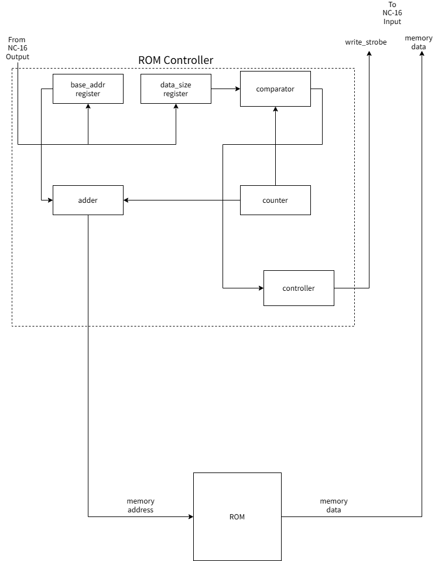
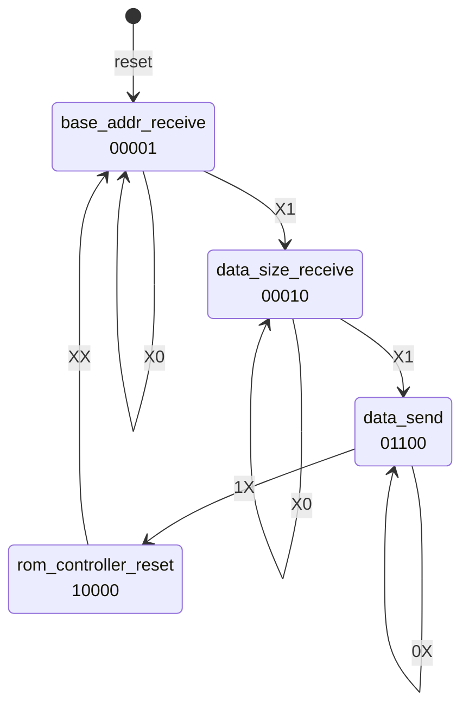

# ROMコントローラ仕様
　本ドキュメントではROMコントローラについて解説します。
## 機能概要
　ROMコントローラは外部機器からの命令に応じて、ROMを適切に制御する部品です。現時点で実装されている機能は次の通りです。
1. NC-16からの指令に応じて、指定番地から指定サイズのデータをNC-16に転送する機能（データ読み込み機能）。
## 各機能インターフェース仕様
### データ読み込み機能
　データ読み込み機能とは、指定番地から、指定サイズのデータをROMからNC-16に転送する機能です。例えば0x1000番地から200バイトのデータをROMからNC-16に転送したい、というときにデータ読み込み機能を使用します。
　
　ROMコントローラには二つの状態が存在します。リセット信号投入直後は、命令受信待機状態になります。

1. 命令受信待機状態
2. データ転送中

　命令受信待機状態のときに「読み出しを行う起点のメモリ番地」「そこからどれくらいの長さのデータを読み込むか」の二つの値を順番にROMコントローラに送信すると、ROMコントローラはROMからNC-16へのデータ送信を開始します。以下はプログラム例です。
```nasm
; 0x1000番地から200バイトデータを読み出す。
out 0x1000 ; 読み出しを行う起点のメモリ番地の指定
out 100 ; 読み出すデータ長。200を2で割った値を指定する。
```
　データ長の指定には注意が必要です。ここで指定するデータ長は、読み込みたいバイト数を2で割った値です。100バイト読み込む場合は、50を指定します。

　ROMコントローラに入力されるクロックが立ち上がるたびに、ROMから16bitのデータが送信されます。データを全て送信し終わると、ROMコントローラは内部状態を全て初期状態に戻して命令受信待機状態に戻ります。　

## 内部ブロック図


※ROMコントローラに入力するクロックは、NC-16に入力しているクロックと同じにする必要があります。

1. base_addrレジスタ：読み出しを行う起点のメモリ番地を格納するレジスタです。
2. data_sizeレジスタ：読み込むデータ長を格納するレジスタです。
3. write_strobe：書き込みストローブ信号です。memory dataの値が有効であるとき1になります。無効であるときは0になります。
4. controller：ROMコントローラの各部品を制御するコントローラです。controllerへの入力信号と現在の状態に応じて、ROMコントローラの各部品を制御する信号（以下制御信号と呼ぶ）を出力し、適切な状態へ遷移します。適切な実体は有限状態マシーンです。

## 状態遷移図
### 出力
　ROMコントローラの各部品を制御する信号（以下制御信号と呼ぶ）の各ビットの意味は次の通りです。
|bit|信号名|
|:--:|:--:|
[4]|rom controller reset
[3]|write_strobe
[2]|counter enable
[1]|data_size register write enable
[0]|base_addr register write enable

- rom controller reset：rom controller resetが1であるとき、ROMコントローラをリセットします。ROMコントローラに搭載された全てのレジスタをリセットする。
- write_strobe：内部ブロック図で示したwrite_strobeと同じ。
- counter enable：counter enableが1であるとき、counterのカウント機能を有効にします。0のとき無効にします。
- data_size register write enable：data_size register write enableが1であるとき、ROMコントローラに入力された信号を、data_sizeレジスタに書き込みます。
- base_addr register write base_addr register write enableが1であるとき、ROMコントローラに入力された信号を、base_addrレジスタに書き込みます。
### 入力
|bit|信号名|
|:--:|:--:|
[1]|send_complete
[0]|input_strobe

- send_complete：data_sizeレジスタとcounterの値が一致したときに1になる信号です。それ以外の場合は0になります。
- input_strobe：ROMコントローラへの入力が有効であるとき1になります。無効であるとき0になります。
### 状態遷移図
　入力、出力ともにMSBから順番に横に記述しています。例えば出力が以下のような値であったとき、10100と記述します。

- rom controller reset：1
- write_strobe：0
- counter enable：1
- data_size register write enable：0
- base_addr register write base_addr：0



各状態は8ビットの値で表されます。各状態に対応した値は次の通りです。
|状態名|値(10進数)
|:--:|:--:|
|base_addr_receive|0|
|data_size_receive|1|
|data_send|2|
|rom_controller_reset|3|