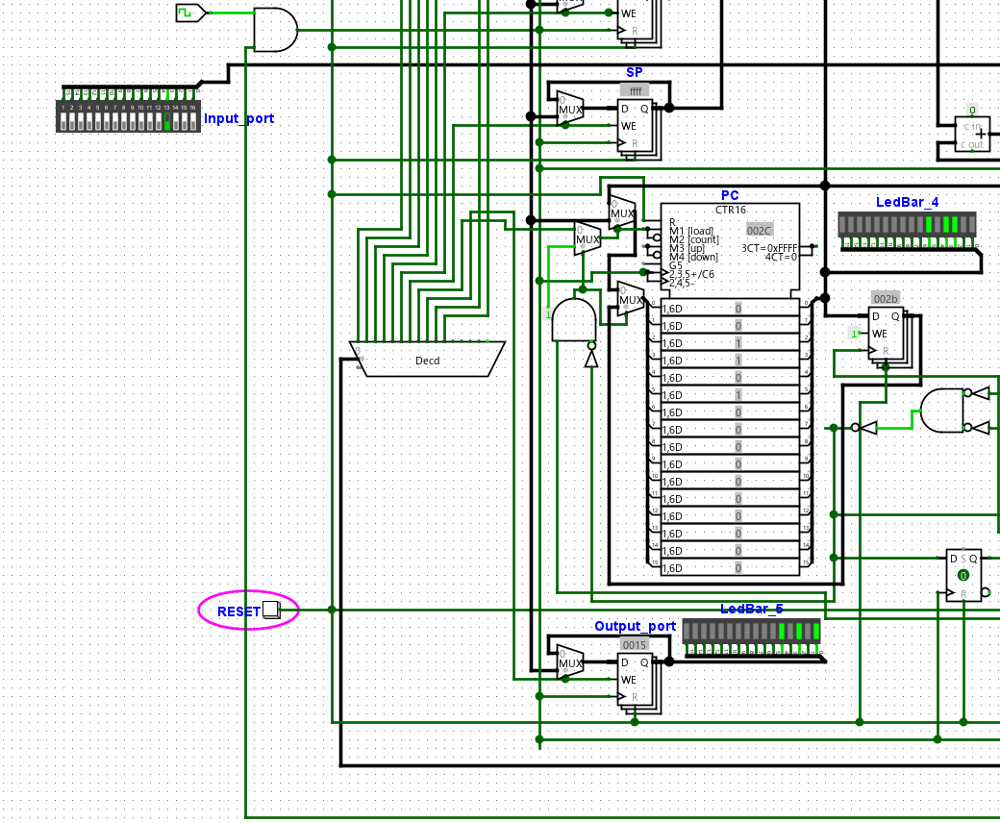

　本ドキュメントはNC-16の操作マニュアルです。
　Logisim-evolutionやcustomasmの導入が済んでいない方は、READMEに記載されている方法にしたがって、導入を済ませてください。

## サンプルプログラムを実行する
　NC-16では下記五つのサンプルプログラムを用意しています。アセンブル済みのバイナリファイルも用意しています。
- （バブル）ソートプログラム。与えられた配列を昇順に整列する(bubble_sort.nc)
- 与えられた配列の値の合計値を求める(sum.nc)
- 任意の項のフィボナッチ数を求めるプログラム(fibonnacci.nc)
- 石取ゲーム(ishitori_game.nc)
- 与えられた入力を左に横スクロールするプログラム(leftscroll.nc)
- 与えられた入力を右に横スクロールするプログラム(rightscroll.nc)

　今回は任意の項のフィボナッチ数を求めるプログラムを実行してみましょう。
### NC-16を開く
　NC-16は``NC16.circ``というファイルに格納されています。Logisim-evolutionがインストールされていれば、該当のファイルをダブルクリックするだけで開くことができます。


　NC-16の各部の役割を説明します。
1. レジスタ群。プログラムの実行に必要なレジスタが配置されています。
2. ALU（Arithmetic and Logic Unit）。算術演算、論理演算の実行を担当します。
3. 入力ポート。16bitの任意の値をCPUに与えられます。2進数で入力します。
4. 命令デコーダ他周辺部品。メモリから読み取ったマシン語を元にCPUの各部品を制御します。いつまで命令フェッチを行うのか、いつ命令を実行するのかを制御するカウンタや、メモリから読み取ったマシン語を一時格納しておくInstruction Registerなどが配置されています。
5. 出力ポート。プログラムの実行結果等がここに出力されます。出力は2進数です。
6. RESETボタン。CPUの状態を初期状態に戻します。
### プログラムを実行する
　NC-16でプログラムを実行するには、以下の手順を踏む必要があります。
1. RAMにプログラムをロードする
2. クロック周波数をセットし、クロックをスタートする
3. RESETボタンを押す

　RAMにプログラムをロードする方法について解説します。回路中にあるRAMを右クリックするとポップアップメニューが表示されます。ポップアップメニューのうち「イメージのロード」ボタンをクリックすると、ロードするファイルを選択するよう要求されます。ロードするファイルを選択すると、別のポップアップウィンドウが開きますが何もせずOKボタンを押します。これでRAMにプログラムがロードされます。
　今回はfibonacci.ncをロードしてください。

　クロック周波数をセットします。クロック周波数を設定するには、Logisim-evolutionウィンドウ上部メニューの「シミュレート」ボタンを押し、表示されたメニューの中から「ティック周波数」を選択してください。設定できるクロック周波数の一覧が表示されますので、適当な周波数を選択してください。

　クロック周波数の設定が終わったら、再度「シミュレート」ボタンを押して、「ティックの有効化」をクリックします。これでクロックがスタートします。Ctrl+Kを押すことでも同じ動作を達成できます。

　後はRESETボタンを押すとプログラムが動作し始めます。

　今回のフィボナッチ数を求めるプログラムの実行では、入力ポートに求めたいフィボナッチ数の項数を入力しておく必要があります。ここでは8項目（2進数1000）を求めます。入力ポートに1000を入力して、RESETボタンを押してください。



　実行が終わると出力ポートにフィボナッチ数8項目の値である、10101(10進数で21)が出力されます。

### 石取りゲームを実行する際の注意
　石取ゲームを実行する場合、NC16.circではなく石取ゲーム実行用.circを開いてください。以降の手順は既に説明したものと同じです。

## アセンブルする方法
　自作プログラムをアセンブルし、バイナリファイルを出力する方法を解説します。ここでは入力ポートからの入力に3を足した値を、出力ポートに出力するプログラムを作成します。

```nasm
#include "nc16_assemble.asm"

in a
add a,0x3
out a
hlt
```

**作成するプログラムの先頭には、必ず#include "nc16_assemble.asm"を含めてください**。

　上記の内容を``main.asm``に保存した場合の、アセンブルするのに必要なコマンドは次の通りです。

```
customasm main.asm -o main.nc
```

　出力されたmain.ncは前述の方法で実行できます。